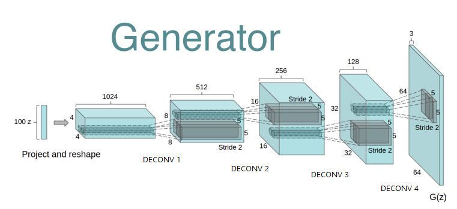
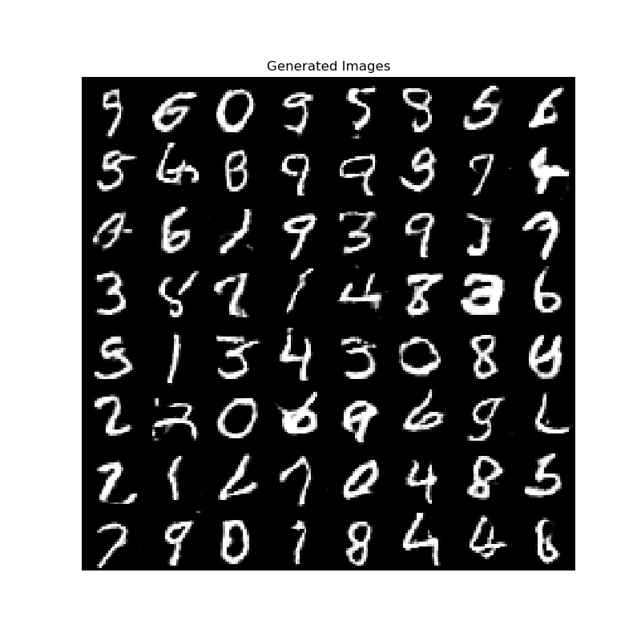
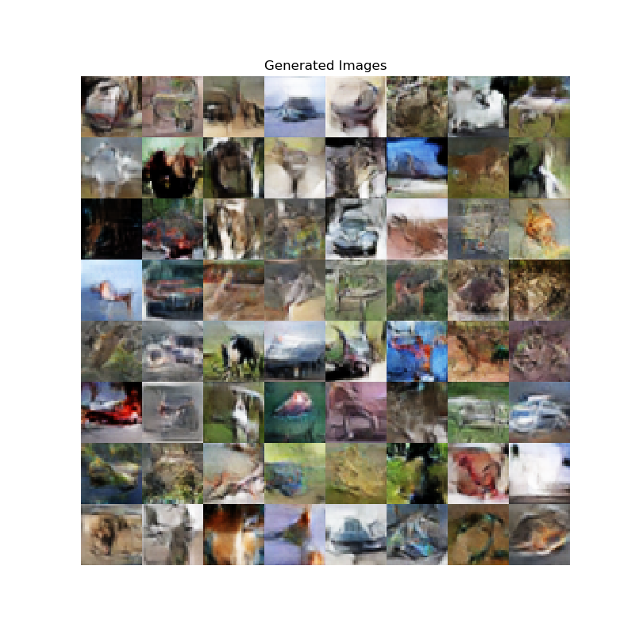

# Deep Convolutional GAN in TensorFlow
This repository contains code of DCGAN which is tested and trained on MNIST and CIFAR-10 datasets. It is based on TensorFlow 2.0 Beta and uses Keras high level API for building layers.


## Generative Adversarial Networks
GANs are generally made up of two models: The Artist (Generator) and The Critic (Discriminator). The generator creates an image from random noise, and the discriminator evaluates the generated image with the images in the given dataset. We train the models by minmaxing the costs of the models. The generator tries to fool the discriminator by producing realistic looking images, and the discriminator becomes better in understanding the difference between real and fake images. This two player game improves the model until the generator produces realistic images or the system reaches nash equilibrium.

## Contents
1. [Setup Instructions and Dependencies](#1-setup-instructions-and-dependencies)
2. [Training Model from Scratch](#2-training-model-from-scratch)
3. [Generating Images from Trained Models](#3-generating-images-from-trained-models)
4. [Model Architecture](#4-model-architecture)
5. [Repository Overview](#5-repository-overview)
6. [Results Obtained](#6-results-obtained)
    1. [Generated Images](#i-generated-images)
    2. [Parameters Used](#ii-parameters-used)
    3. [Loss Curves](#iii-loss-curves)
7. [Observations](#7-observations)
8. [Credits](#8-credits)

## 1. Setup Instructions and Dependencies
You may setup the repository on your local machine by either downloading it or running the following line on `cmd prompt`.

``` Batchfile
git clone https://github.com/Atharv24/GenZoo.git
```

The trained models are large in size and hence their Google Drive links are provided in the `model.txt` file.

The data required for training is automatically downloaded when running `train.py`.

All dependencies required by this repo can be downloaded by creating a virtual environment with Python 3.7+ and running

``` Batchfile
pip install -r requirements.txt
```

## 2. Training Model from Scratch
To train your own model from scratch, run

```Batchfile
python train.py -config path/to/config.ini
```

+ The parameters for your experiment should be set in your `config.ini` file.
+ The training script will create a folder **exp_name** as specified in your `config.ini` file.
+ This folder will contain all data related to your experiment such as tensorboard logs, images generated during training and training checkpoints.

## 3. Generating Images from Trained Models
To generated images from trained models, run

```Batchfile
python generate.py -dataset mnist/cifar -load_path path/to/checkpoint -grid_size n -save_path directory/where/images/are/saved
```

The arguments used are explained as follows

+ `-dataset` requires either `mnist` or `cifar` according to what dataset the model was trained on.
+ `-load_path` requires the path to the training checkpoint to load. Point this towards the *.index file without the extension. For example `-load_path training_checkpoints/ckpt-1`.
+ `-grid_size` requires integer `n` and will generate n*n images in a grid.
+ `-save_path` requires the path to the directory where the generated images will be saved. If the directory doesn't exist, the script will create it.

To generate images from pre-trained models, download checkpoint files from the Google Drive link given in the `model.txt` file.

## 4. Model Architecture
### Generator Model

+ Each Dense and Conv2DTranspose layer is accompanied by LeakyReLU and BatchNorm layer, except the last layer, which has TanH activation.
+ Input is a 100-dimensional noise. It is repeatedly upsampled to produce either a 28x28x1 (MNIST) or 32x32x3 (CIFAR-10) image.

### Discriminator Model

+ The Conv2D layers are followed by LeakyReLU and Dropout layers.
+ Output is a single number which tells if the image is real or fake/generated.

## 5. Repository Overview
This repository contains the following files and folders

1. **configs**: This folder contains config.ini files used for specifying the hyperparameters used in experiments.

2. **experiments**: This folder contains data for different runs.

3. **resources**: Contains media for `readme.md`.

4. `data_loader.py`: Contains helper functions that load and preprocess data.

5. `generate.py`: Used to generate and save images from trained models.

6. `model.py`: Contains helper functions that create generator and discriminator models.

7. `model.txt`: Contains google drive links to trained models.

8. `requirements.txt`: Lists dependencies for easy setup in virtual environments.

9. `train.py`: Contains code to train models from scratch.

## 6. Results Obtained
### i. Generated Images
Samples generated after training model for 30 epochs on MNIST.


Samples generated after training model for 100 epochs on CIFAR-10.


### ii. Parameters Used
+ Optimizer used is Adam
+ Learning rate 0.0002, beta-1 0.5
+ Trained for 30 epochs (MNIST) and 100 epochs (CIFAR-10)
+ Batch size is 32 (MNIST) and 128 (CIFAR-10)
+ The model uses label flipping (i.e. real images are assigned 0 and fake images are assigned 1)
+ Label smoothing is also used

### iii. Loss Curves
#### MNIST


#### CIFAR-10


## 7. Observations
### MNIST
The model takes only 30 epochs to train which happens in under 6 mins in Google Colab. The generated images are quite sharp and are usually indistinguisable from the real data. The model captures the subtlety of the data and is able to create images which look handwritten.

Training for long duration (100+ epochs) does not seem to improve the model's performance and sometimes even deteriorates the quality of the images produced.

### CIFAR-10
Training on the CIFAR-10 dataset was challenging. The dataset was varied and the network has a higher number of parameters to train. This resulted in training times of upto 1.5 min/epoch on Google Colab. The model was trained for 100 epochs and produced images which were similar to the dataset.

However the main problem faced by me was observing 32x32 images and evaluating if they were 'good enough'. The images are too low-resolution to properly understand the subject but they are easily passable since they look quite similar to the real data.

Some images have noise but most images don't have much artifacts in them. This is partly due to the network training on all of the 10 labels of the CIFAR-10 dataset. Better results could be obtained by only training the network on one particular label at a time but this takes away the robustness of the model.

## 8. Credits
To make this repository I referenced multiple sources:
+ [Generative Adversarial Networks — Goodfellow et al. (2014)](https://arxiv.org/abs/1406.2661)
+ [DCGANs — Radford et al. (2015)](https://arxiv.org/abs/1511.06434)
+ [MIT intro to deep learning (2019) - Lecture 4](https://www.youtube.com/watch?v=yFBFl1cLYx8)
+ [TensorFlow DCGAN tutorial](https://www.tensorflow.org/beta/tutorials/generative/dcgan)
